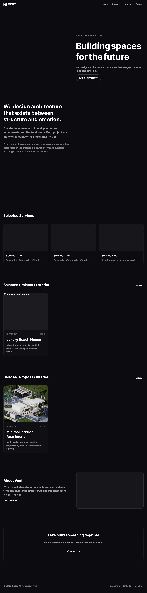
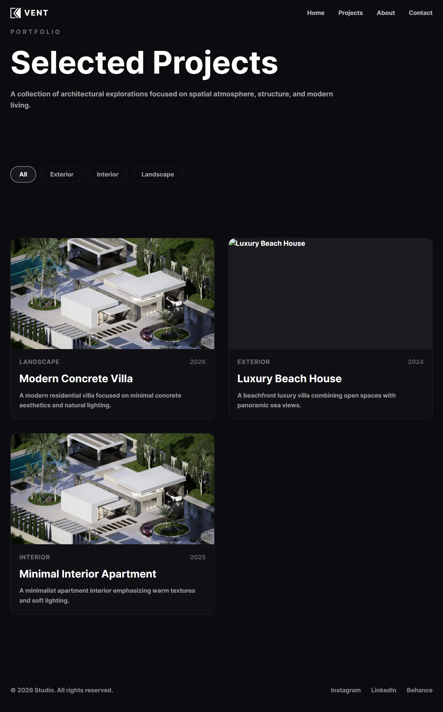
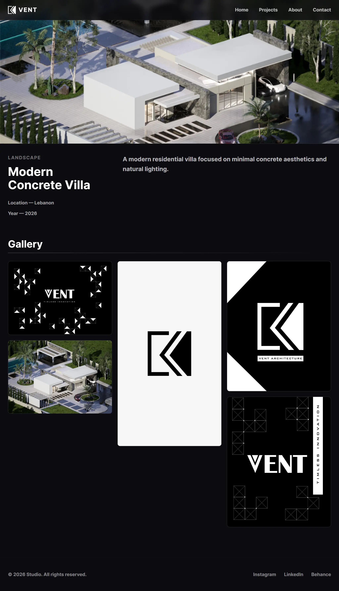
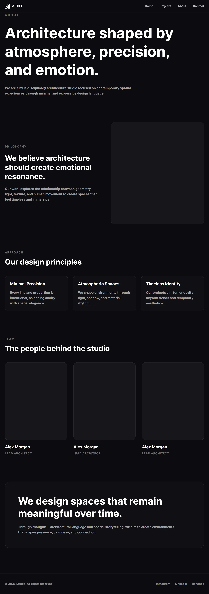
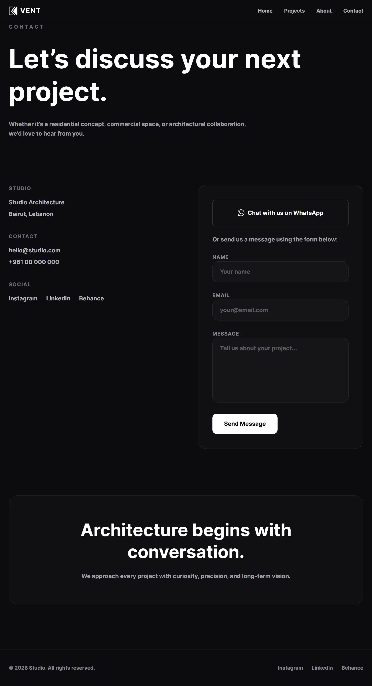

# 🏛️ VENT Architecture Portfolio

> A modern full-stack portfolio platform developed for an architecture team to showcase their services, projects, and creative work through an interactive web experience.

VENT combines a responsive React frontend with a Laravel backend, providing visitors with an immersive portfolio experience while allowing administrators to manage website content through a dedicated dashboard.

---

## ✨ Features

## Visitor Experience

* Modern responsive architecture portfolio website
* Interactive 3D elements integrated into the homepage
* Scroll-based 3D animations
* Services showcase
* Projects showcase
* Project details pages
* About section
* Contact form
* Smooth and engaging user experience

## Administrator

* Secure authentication system
* Admin dashboard
* Architecture Project management
* Create, update, and delete projects
* Content management capabilities

---

## 🎨 3D Experience

The homepage includes interactive 3D models built using:

* React Three Fiber
* React Drei

The models respond to user scrolling, creating an immersive experience that enhances the visual presentation of the architecture portfolio.

---

## 🛠 Tech Stack

### Frontend

* React
* Vite
* React Three Fiber
* React Drei
* JavaScript
* CSS

### Backend

* Laravel
* PHP
* REST APIs
* Authentication

### Database

* MySQL

### Tools

* Git & GitHub
* Composer
* npm
* VS Code

---

## 📸 Screenshots

The following screenshots showcase the main user experience and features of the platform.

---

## 🏠 Home Page

The landing page introduces the architecture team through a modern interactive experience.



---

## 🎨 Interactive 3D Experience

The homepage includes interactive 3D elements built using React Three Fiber and React Drei.

The 3D model and custom SVG illustrations are positioned throughout the page and respond to user interaction and scrolling.


---

## 🏛️ Projects Showcase

Visitors can explore the architecture team's projects through a dedicated projects page.



---

## 📄 Project Details

Each project has its own details page to present information and visual content.



---

## 👥 About & Contact

The platform includes dedicated pages to introduce the team and allow visitors to get in touch.

### About Page



### Contact Page



---

## ⚙️ Admin Dashboard

Administrators can manage website content through a secure dashboard.

Features include project management and content updates.


---

## 🔐 Authentication

The backend provides authentication functionality for administrators, including:

* Login
* Protected admin routes
* Session management
* Authorization

---

## 📊 Admin Dashboard

The dashboard allows administrators to manage website content, including:

* View website information
* Manage architecture projects
* Add new projects
* Update existing projects
* Delete projects

---

## 📂 Project Structure

```text
VENT/

├── frontend/     # React + Vite application

├── backend/      # Laravel backend API

└── docs/         # Screenshots and documentation
```

---

## 💡 Future Improvements

* Online project filtering
* More advanced 3D interactions
* Image gallery optimization
* Analytics dashboard
* Deployment automation

---

## 👨‍💻 Author

Developed by:

**Ahmad Naim**
